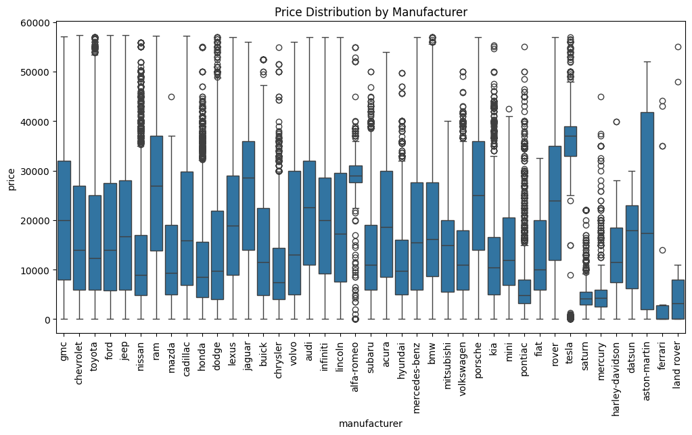
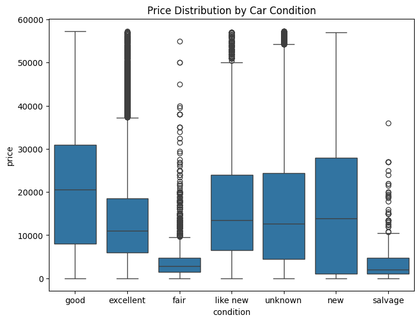
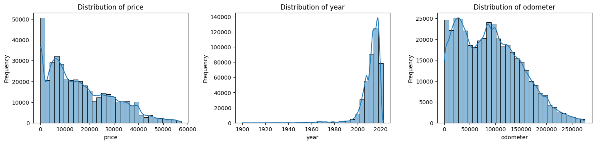
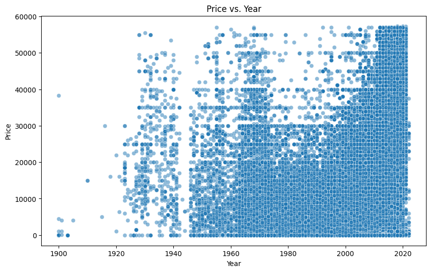
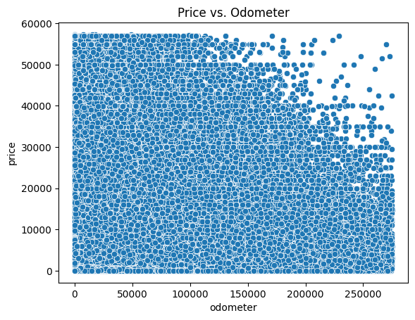
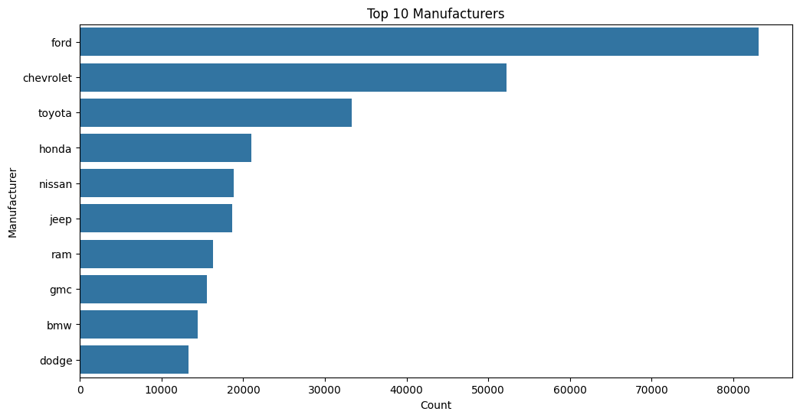
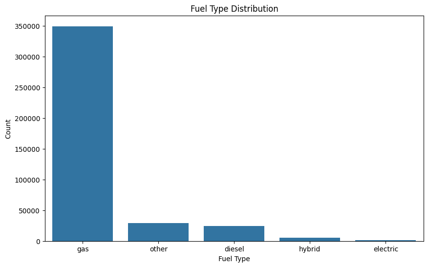
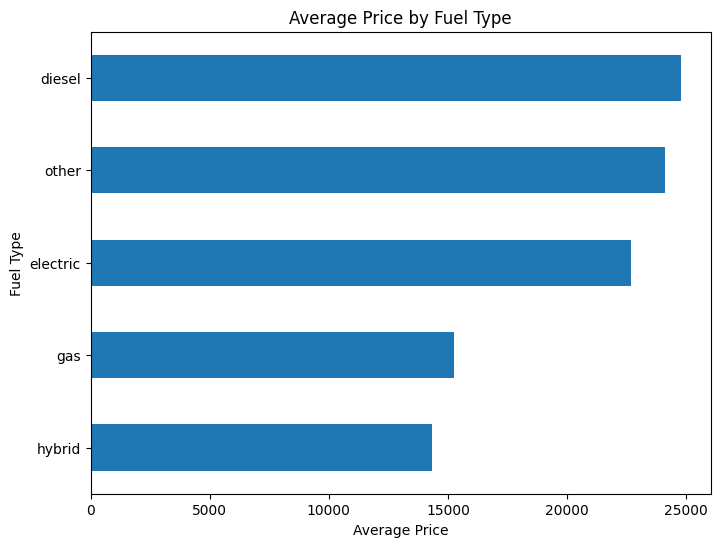
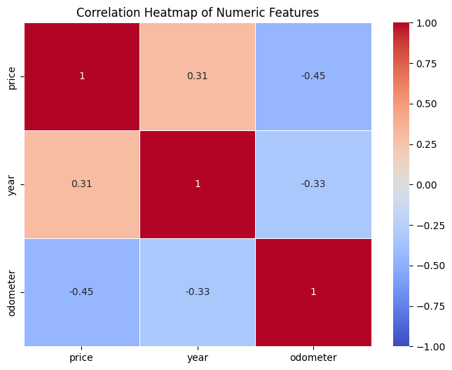

# **Exploratory Data Analysis (EDA) on Used Cars in the United States**

### **Project Overview**
- **Name:** Prabhas Teja Penugonda  
- **Company:** CODTECH IT Solutions  
- **ID:** CT6WDS1908  
- **Domain:** Data Science  
- **Duration:** September to October 2024  
- **Mentor:** Neela Santhosh Kumar  

This project focuses on **Exploratory Data Analysis (EDA) on used car listings** across the United States to uncover insights into car prices, conditions, brands, and other key variables through data cleaning, analysis, and visualizations.

---

## **Objective**
The goal of this project is to perform **EDA on a dataset of used cars** to:
- Understand **distribution and trends** in car prices, brands, and conditions.
- **Identify patterns, correlations, and outliers** within the dataset.
- Gain insights that can help **buyers, sellers, or market analysts** make data-driven decisions.

---

## **Key Activities**
1. **Data Cleaning:**  
   - Removed inconsistencies and missing values to ensure the data is suitable for analysis.
   - Dropped irrelevant or redundant columns to optimize performance.

2. **Data Visualization:**  
   - Created **box plots, histograms, bar charts**, and **scatter plots** to visualize data distributions, relationships, and patterns.

3. **Correlation Analysis:**  
   - Generated **heatmaps** to identify correlations between features like price, condition, and other variables.

---

## **Technologies Used**
- **Python:** Primary language for data manipulation and visualization.
- **pandas:** Used for data manipulation and cleaning.
- **matplotlib:** For generating static and interactive visualizations.
- **seaborn:** To create appealing statistical graphics.

---

## **Key Insights**

### 1. **Price Distribution by Manufacturer**
- **Description:** This box plot shows the distribution of prices for different car manufacturers, helping understand how prices vary across brands.



---
### 2. **Price Distribution by Car Condition**
- **Description:** This box plot shows how prices vary across different car conditions (e.g., excellent, good, fair, new, etc.).
  


---

### 3. **Multi-Histogram Visualization of Key Variables**
- **Description:** This output consists of five histograms that illustrate the distributions of key variables: price, year of manufacture, and manufacturer. Each histogram provides insights into how these variables relate to one another and their overall distributions within the dataset.



---


### 4. **Scatter Plot of Price vs. Year**
- **Description:** This scatter plot shows the relationship between car prices and the year of manufacture, highlighting trends in pricing over time.



---

### 5. **Scatter Plot of Price vs. Odometer**
- **Description:** This scatter plot illustrates the relationship between car prices and odometer readings (mileage), showing how usage affects pricing.



---

### 6. **Top 10 Manufacturers Count Plot**
- **Description:** This count plot highlights the top 10 manufacturers by the number of cars listed in the dataset.



---

### 7. **Fuel Type Distribution**
- **Description:** This count plot displays the distribution of cars based on their fuel type (e.g., gasoline, diesel, hybrid).



---

### 8. **Average Price by Fuel Type**
- **Description:** This count plot shows the average price of cars for each fuel type, providing insights into how fuel type affects pricing.



---

### 9. **Heatmap of Correlations Between Features**
- **Description:** This heatmap highlights correlations between features like price, mileage, year of manufacture, and condition.

 

---

## **How to Run the Project**

1. **Clone the Repository:**
   ```bash
   git clone <https://github.com/prabhasteja007/CODTECH-Task1>
   cd your-repository-name
